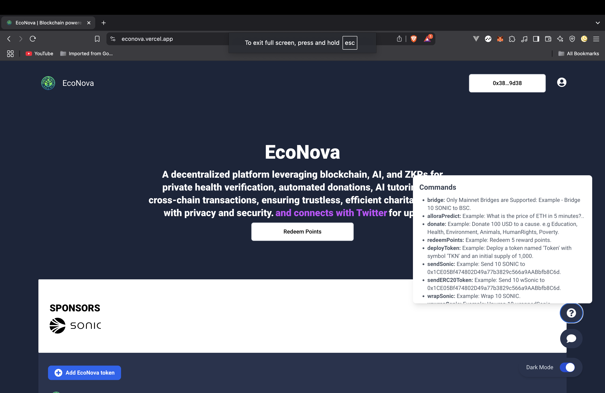
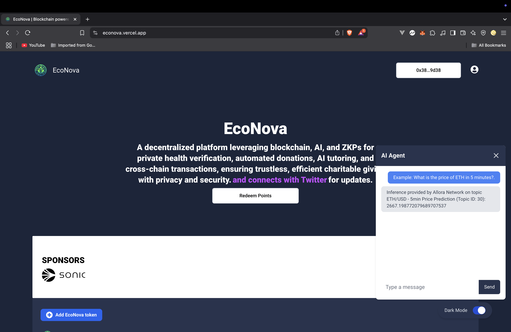

# EcoNova

EcoNova is a decentralized platform integrating **blockchain technology,DeFi and AI**

## 🌍 **Key Integrations**

✅ **ZK-BMI verification**  
🤖 **AI-powered tutoring**  
💸 **Automated donations (powered by Gelato)**  
📢 **Social media engagement rewards (powered by Zerepy)**  
🔁 **Cross-chain transfers via deBridge & LayerZero**   
🔍 **AI audit with FlareScan, GitHub Solidity analysis, and security compliance checks**

---

## 🔹 **Automated Donations via Gelato**

EcoNova automates donations using **Gelato**, a decentralized smart contract automation protocol, ensuring:

- **Gasless & trustless transactions** ⛽
- **Smart contract-driven donation scheduling** 🕒
- **Fully autonomous fund distribution** 💸
- **No reliance on manual execution** 🚀

Donors can set predefined conditions (e.g., recurring donations, impact-based donations) that execute automatically when criteria are met.

---

## 🔹 **AI Tutor (Flare & DeFiAI)**

EcoNova features an **AI-powered tutor** to educate users on:

- **Blockchain fundamentals** 🏗️
- **Decentralized Finance (DeFi)** 💱
- **Smart contract security** 🔐

Users can take quizzes to earn rewards, including NFTs.

---

## 🔹 **Cross-Chain Transfers**

EcoNova enables **secure & cost-efficient cross-chain transfers** using:

### 🔀 **deBridge for Flare-to-Polygon Transfers**

💱 **deBridge** allows seamless asset transfers from **Flare to Polygon**, ensuring:

- **Fast & cost-effective transfers** ⚡
- **Improved liquidity across chains** 🔄
- **Decentralization over centralized bridges** 💡

### 🔀 **LayerZero for EcoNovaToken Transfers**

🌉 **LayerZero** powers **EcoNovaToken** transfers across multiple chains, ensuring:

- **Seamless interoperability between networks** 🔗
- **Trustless and decentralized bridging** 🏦
- **Efficient cross-chain transactions for donations & rewards** 💸

---

## 🔹 **Engagement Rewards via Zerepy**

EcoNova’s **Twitter bot, EcoNova_bot**, powered by **Zerepy**, automatically:

- **Posts updates** 📢
- **Tracks user engagement (likes, retweets)** 🔍
- **Rewards users with tokens based on interactions** 🎁
- **Encourages community-driven fundraising** 🤝

⚠️ **Note:** Twitter login **will not work** due to callback URL restrictions. Ensure the frontend URL is properly configured.

---

## 📡 **Smart Contract Infrastructure**

EcoNova is deployed on **Ethereum-compatible chains** and utilizes:

- **Solidity-based smart contracts**
- **Interoperable ERC-20/ERC-721 tokens**
- **Pyth price oracles for fair value conversions**

---

## 🔐 **Security & Compliance**
- **Decentralized fund allocation** with no single point of failure
- **Secure & trustless cross-chain transfers via deBridge & LayerZero**
- **Automated & gas-efficient donations using Gelato**

---

## 🤖 **AI Audit**

EcoNova integrates **AI-powered smart contract auditing** using:

- **[FlareScan API](https://api.sonicscan.org)** for verified contract address checks
- **GitHub Solidity file analysis** to detect vulnerabilities
- **Manual Solidity audit support** via file input
- **Gas optimization suggestions** to reduce transaction costs
- **Security compliance checks** to enhance contract safety

---

## 🚀 **Start the Application**

### 1️⃣ **Start with Docker**

- **Set up secrets from `.env`**

  ```sh
  sh create-secrets.sh
  ```

📌 _Ensure the `.env` file exists and is configured in both the backend and frontend directories before running this script!_

- **Ensure Docker is installed and running.**
- **To start the backend and related services (MongoDB and Redis), run:**

  ```bash
  docker compose up
  ```

- The application will be accessible at **`localhost:3000`**.

---

## 🎥 **Watch EcoNova in Action**

Learn more about EcoNova by watching our demo videos:

- [EcoNova Overview](https://www.youtube.com/watch?v=I0GPMudkcus)

---

## 📌 **Pages**

- **/bridge** → Bridge Sonic to Polygon with deBridge  
  → Bridge EcoNovaToken to Polygon with LayerZero

- **/donate** → Donate to a charity cause and earn points
- **/dao** → DeFiAI governance
- **/tx-analysis** → Analyze transaction hash
- **/ai-tutor** → Learn about DeFi and AI, take quizzes, and claim an NFT
- **/ai-audit** → Audit verified smart contracts, GitHub Solidity files, and local files
- **/ai-portfolio-manager** → Analyze Flare and USD.e balances, set goals, and rebalance portfolios
- **/leaderboard** → View ranked users based on points and token balances
- **/earn-points** → Earn points by liking and retweeting posts made by the bot.

---

## 🤝 **Contribute**

Want to help? Submit a PR or report issues via our **[GitHub](https://github.com/Imdavyking/econova/)**.

---

## 📷 **Images**

 

---

## 📜 **Documentation**

For detailed guides, visit our **[documentation](https://econovadocs.vercel.app/)**.

---

## 📬 **Stay Connected**

- **Twitter:** [@EcoNova_Bot](https://x.com/EcoNova_Bot)
- **Docs:** [Read the Docs](https://econovadocs.vercel.app/)
- **GitHub:** [EcoNova](https://github.com/Imdavyking/econova/)

🚀 **Join us in revolutionizing DeFiAi!**
